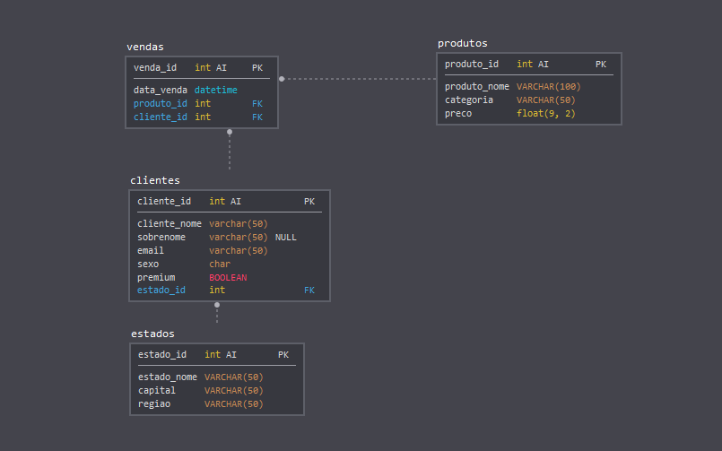

# LojinhaDB :department_store:
Uma database construída em MySQL simulando uma DB de uma loja de produtos.
É um projeto pessoal meu que consiste em criar uma database mais um pouco avançada do básico, com algumas tabelas, estabelecer um relacionamento entre elas, para performar queries mais complexas como JOINS, funções, todos com o objetivo de mostrar informações interessantes sobre os dados inseridos nela.

## Meu Schema

A DB consiste de 4 tabelas: Produtos, Clientes, Estados e Vendas.

### Tabela Produtos
A tabela produtos é criada para guardar as informações relacionadas aos produtos da loja, ela não é dependente direta de nenhuma tabela, mas é uma das dependências da tabela de vendas.
Consiste em 4 campos:
- **produto_id**: `INT` - É a primary key da nossa tabela, identifica unicamente cada registro dela, com o datatype `INT`. 
- **produto_nome**: `VARCHAR(100)` - Uma String com o comprimento máximo de 100 caracteres, dando e é o nome do produto.
- **categoria**: `VARCHAR(50)` - Uma String com o comprimento até 50 caracteres, é a categoria do produto, onde poderemos realizar filtragens.
- **preco**: `FLOAT(9, 2)` - Um ponto flutuante, representando o preço do produto podendo tirar informações `int`eressantes, como soma de lucro de produtos vendidos, informação dos produtos mais caros e mais baratos, etc...

### Tabela Clientes
Registro de cada cliente da loja, contendo uma `FOREIGN KEY` para a tabela de estados. Contem os campos:
- **cliente_id** : `INT` - Um identificador único para cada cliente na tabela.
- **cliente_nome**: `VARCHAR(50)` - O nome do cliente, sendo esse obrigatório.
- **sobrenome**: `VARCHAR(50)` - O sobrenome do cliente, sendo esse opcional.
- **email**: `VARCHAR(50)` - O email do cliente.
- **sexo**: `CHAR(1)` - O sexo. Podendo ser 'M' (Masculino) ou 'F' (Feminino).
- **premium**: `BOOLEAN` - O status de premium do cliente.
- **estado_id**: `INT` - ID do estado em que se mora o cliente.

### Tabela Estados
Registro dos estados brasileiros, com o objetivo de ofercer informações adicionais às vendas.
Contem os campos:
- **estado_id**: `INT` - Um identificador único para o estado.
- **estado_nome**: `VARCHAR()` - O nome do estado.
- **capital**: `VARCHAR()` - A respectiva capital.
- **regiao**: `VARCHAR()` - A região em que o estado se encontra. Podendo ser: Norte, Nordeste, Sudeste, Sul, Centro-Oeste.

### Tabela Vendas
Registra as vendas totais da loja. Ela estabelece relações com as tabelas de produtos e clientes.
- **venda_id**: `INT` - Servindo para identificar unicamente as demais vendas.
- **cliente_id**: `INT` - O Identificador do cliente proveniente da tabela clientes, o qual realizou a compra.
- **produto_id**: `INT` - O Identificador do produto proveninente da tabela produtos, do produto a ser comprado.
- **data_venda**: `DATETIME` - Data da venda realizada.É inserido automaticamente, quando se insere um novo registro à tabela.
  

## Instalação e Configuração da DB
Não disponibilizo realmente a DB em um servidor. Caso você queira ter acesso à DB com esse schema, disponibilizei scripts em SQL definindo toda a DB, como criação da DB, criação das tabelas, mas também disponibilizando scripts para população de dados nas tabelas. Além de tudo, há um script com muitas queries que você possa consultar e extrair informações interessantes.

Os scripts estão disponíveis na pasta `/scripts` dessa repo. Determinarei uma ordem que você deve seguir para a instalação, configuração e população dos dados sem erros:
1. `scripts/inicializando_db.sql`
2. `scripts/popular_produtos.sql`
3. `scripts/popular_estados.sql`
4. `scripts/popular_clientes.sql`
5. `scripts/popular_vendas.sql`

Para as queries, está tudo no arquivo `queries.sql`. As funções e stored queries estão cada um em seus arquivos: `funcoes.sql` e `procedures.sql`.

## Acho que é isso! :open_mouth:
A database tem propósitos de aprendizado, e qualquer ajuda para o melhoramento será bem vindo.

Entre em contato comigo, caso queria: cleberson.dev@gmail.com

Passar bem! :wink: